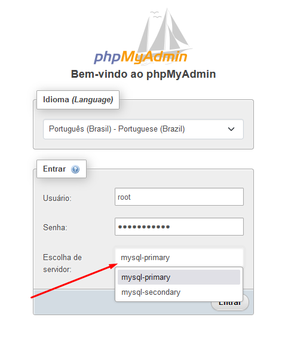
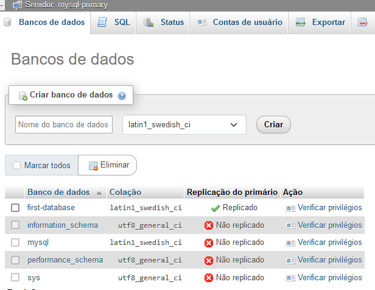
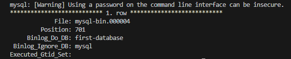
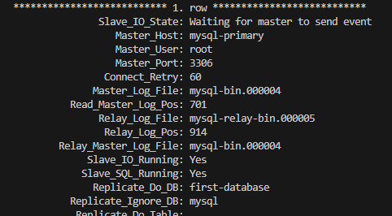

# docker-mysql-replication

## Introdução

O objetivo desse repositório é automatizar algumas operações que seriam efetuadas manualmente. Além de fornecer um guia prático para configurar replicação de banco de dados MySQL em ambiente de homologação.

Este repositório utiliza as tecnologias:

- **MySQL:** Banco de dados relacional de código aberto, robusto e popular.
- **Docker:** Plataforma de containers que facilita a criação, implantação e gerenciamento de aplicações.

## Resumo para iniciar banco de dados

1. Configure o arquivo `.env` com as credenciais desejadas para o banco de dados
   ```env
   MYSQL_USER=first-user
   MYSQL_PASSWORD=first-user-password
   MYSQL_PORT=3306
   MYSQL_ROOT_PASSWORD=database-root-password
   SECONDARY_MYSQL_PORT=3307
   ```
2. Subir o banco de dados
   `docker-compose -f "docker-compose.yml" up -d --build`
3. Aguarde a inicialização do banco de dados no docker, depois acesse `http://localhost:8080` e faça login no servidor primário `mysql-primary` com as credenciais configuradas em `.env`, para se certificar que está tudo certo.
4. Inicie a replicação do banco de dados executando `bash start_slave.sh` no terminal.

### Observações

Somente o banco de dados configurado no arquivo `.env` será replicado. Você pode verificar no arquivo `docker-compose.yml`:

```yml
version: "3.8"

services:
  mysql-primary:
    image: mysql:5.7.12
    container_name: mysql-primary
    #...
    command: [
        #...
        "--binlog-do-db=${MYSQL_DATABASE:-mydb}",
      ]
    #...
  mysql-secondary:
    image: mysql:5.7.12
    container_name: mysql-secondary
    #...
    command: [
        #...
        "--replicate-do-db=${MYSQL_DATABASE:-mydb}",
      ]
    #...
```

A variável foi comentada no arquivo de configuração `./primary/conf.d/my.cnf` e `./secondary/conf.d/my.cnf` para tornar possível a utilização de variável de ambiente:

```cnf
[mysqld]
server-id=1
log-bin=mysql-bin
# --> binlog-do-db=first-database
binlog-ignore-db=mysql
binlog-format=row
bind-address=0.0.0.0
```

Tela de login do PhpMyAdmin
 

---

## Tutorial

A replicação de banco de dados é uma técnica essencial para garantir a confiabilidade, escalabilidade e segurança do ambiente de produção. Ao criar réplicas do seu banco de dados de produção, você pode testar novas funcionalidades, realizar simulações e executar tarefas de carga sem afetar o sistema principal.

Neste tutorial, você aprenderá como configurar e usar a replicação de banco de dados em seu ambiente de homologação. Abordaremos os seguintes tópicos:

- [Iniciar o ambiente](#iniciar-o-ambiente)
  - [Instalação do Docker](#intalação-do-docker)
  - [Instalação do docker-compose](#intalação-do-docker-compose)
  - [Instalação do Git](#intalação-do-git)
  - [Clona o repositório](#clona-o-repositório)
- [Explicando configuração para servidor primário](#explicando-configuração-para-servidor-primário)
- [Explicando configuração para servidor secundário](#explicando-configuração-para-servidor-secundário)
- [phpMyAdmin](#phpmyadmin)
- [Script para iniciar a replicação](#script-para-iniciar-a-replicação)

### Requisitos

- Conhecimento básico sobre AWS EC2 [AWS EC2](https://aws.amazon.com/pt/ec2/)
- Conhecimento básico sobre Docker [Docker](https://www.docker.com/)
- Conhecimento básico sobre MySQL [MySQL](https://www.mysql.com/)

### Iniciar o ambiente

Vamos trabalhar com um ambiente de homologação, onde teremos dois servidores MySQL configurados para replicação. Para isso, utilizaremos a AWS EC2 para criar uma única instancia EC2 com duas portas abertas (3306 e 3307), uma para o servidor primário e outra para o servidor secundário. Porém, após o conhecimento adquirido, você poderá separar os servidores em instâncias diferentes.

Lembrando que, para fins de estudo, utilizaremos o Docker para simular o ambiente de homologação. Em produção a AWS oferece formas mais seguras, robustas e escaláveis de configurar a replicação de banco de dados, por exemplo, utilizando o [RDS](https://aws.amazon.com/pt/rds/).

Assumindo que você já tenha uma conta na AWS, e também ja possui uma instancia [EC2 Amzon Linux 2023](https://aws.amazon.com/pt/linux/amazon-linux-2023/) configurada, com acesso ssh vamos prosseguir com a configuração do ambiente.

> **Ganhe tempo:** Para evitar problemas, é importante escolher uma instancia com arquitetura _64 bits x86_, pois a imagem do MySQL 5.7 utilizada neste tutorial é compatível com essa arquitetura. Caso precise de uma instancia com arquitetura ARM, você pode utilizar a imagem do MySQL 8.0 (ou mais recente), ou então utilizar uma imagem _não oficial_ do [MySQL 5.7 para arquitetura ARM](https://github.com/biarms/mysql). _Aqui, selecionei a versão específica `mysql:5.7.12` pois existe compilação não oficial para arquitetura ARM._

#### Intalação do Docker

A instalação do Docker é bem simples.

1. Instale: `sudo dnf install docker`
2. Aplique na inicialização:
   `sudo systemctl start docker`
   `sudo systemctl enable docker`
3. Verifique se está tudo certo: `sudo systemctl status docker`
4. Adicione privilégios ao usuário atual para executar comandos docker sem precisar de `sudo`: `sudo usermod -aG docker $USER`,
5. Aplicar ao grupo: `newgrp docker`

referência: [How to install Docker on Amazon Linux 2023](https://linux.how2shout.com/how-to-install-docker-on-amazon-linux-2023/)

#### Intalação do docker-compose

1. Instalar docker compose `sudo curl -L https://github.com/docker/compose/releases/latest/download/docker-compose-$(uname -s)-$(uname -m) -o /usr/local/bin/docker-compose`
2. Aplicar permissões de execução: `sudo chmod +x /usr/local/bin/docker-compose`
3. Verificar a instalação: `docker-compose --version`

#### Intalação do Git

1. Instale: `sudo dnf install git` ou `sudo yum install -y git`
2. Configure o git com seu nome e email:
   `git config --global user.name "Seu Nome"`
   `git config --global user.email "seuemail@seuemail.com"`

Agora, configure uma chave SSH para o seu repositório no GitHub, para que você possa clonar este repositório.

1. `cd ~/.ssh`
2. `ssh-keygen -o -t rsa -C "seuemail@seuemail.com"`
3. `cat id_rsa.pub`
4. Copie a chave gerada e adicione-a ao seu repositório no [GitHub Settings](https://github.com/settings/keys).
   Veja: [Adicionar chave SSH ao GitHub](https://docs.github.com/pt/authentication/connecting-to-github-with-ssh/adding-a-new-ssh-key-to-your-github-account)
5. Teste a conexão: `ssh -T git@github.com`

> **Observação:** A mesma configuração de chave serve para o Bitbucket e GitLab.

#### Clona o repositório

1. Clone o repositório:
   `git clone git@github.com:leguass7/docker-mysql-replication.git`
2. Acesse o diretório do repositório:
   `cd docker-mysql-replication`
   crie um arquivo `.env` com as credenciais desejadas para o banco de dados.
   `nano .env`

#### Iniciar serviços

1. Subir o banco de dados
   `docker-compose -f "docker-compose.yml" up -d --build`
2. Aguarde a inicialização do banco de dados no docker, depois acesse `http://localhost:8080` e faça login no servidor primário `mysql-primary` com as credenciais configuradas em `.env`, para se certificar que está tudo certo.
3. Inicie a replicação do banco de dados executando `bash start_slave.sh` no terminal.

### Explicando configuração para servidor primário

O arquivo `docker-compose.yml` contém a configuração dos serviços `mysql-primary` e `mysql-secondary`. O serviço `mysql-primary` é o servidor primário, que será responsável por receber as requisições de escrita e replicar os dados para o servidor secundário. O serviço `mysql-secondary` é o servidor secundário, que será responsável por receber as requisições de leitura e replicar os dados do servidor primário.

Não há muita diferença de uma configuração padrão de um servidor MySQL com `docker-compose`, exceto por algumas diferenças que será explicado adiante.

```yml
version: "3.8"

services:
  mysql-primary:
    image: mysql:5.7.12
    container_name: mysql-primary
    restart: unless-stopped
    tty: true

    environment:
      MYSQL_ROOT_PASSWORD: ${MYSQL_ROOT_PASSWORD:-myrootpassword}
      MYSQL_DATABASE: ${MYSQL_DATABASE:-mydb}
      MYSQL_USER: ${MYSQL_USER:-myuser}
      MYSQL_PASSWORD: ${MYSQL_PASSWORD:-myuserpassword}
      # TZ: ${TZ}

    command:
      [
        "--sql_mode=NO_ENGINE_SUBSTITUTION",
        "--default-authentication-plugin=mysql_native_password",
        "--server-id=1",
        "--binlog-do-db=${MYSQL_DATABASE:-mydb}",
      ]
    cap_add:
      - all
    ports:
      - ${MYSQL_PORT:-3306}:3306
    expose:
      - ${MYSQL_PORT:-3306}
    volumes:
      - ./primary/conf.d:/etc/mysql/conf.d
      - ./primary/log/mysql:/var/log/mysql
      - ./primary/data:/var/lib/mysql
    networks:
      mysql_network:
        ipv4_address: 172.26.0.254

networks:
  mysql_network:
    driver: bridge
    ipam:
      config:
        - subnet: 172.26.0.0/16
          gateway: 172.26.0.1

volumes:
  mysql_primary_data:
```

Vamos nos atentar apenas para as configurações que são específicas para a replicação de banco de dados.

```yml
#...
tty: true
command:
  [
    "--sql_mode=NO_ENGINE_SUBSTITUTION",
    "--default-authentication-plugin=mysql_native_password",
    "--server-id=1",
    "--binlog-do-db=${MYSQL_DATABASE:-mydb}",
  ]
#...
```

- `tty: true`: Habilita a alocação de um pseudo-TTY para o container. Isso é útil para que possamos acessar o terminal do container e executar comandos diretamente no servidor MySQL. Veremos isso quando chegar a hora de escrever o script para iniciar a replicação.

- `--server-id=1`: Identifica o servidor primário. Cada servidor deve ter um `server-id` único.
- `--binlog-do-db=${MYSQL_DATABASE:-mydb}`: Especifica o banco de dados que será replicado. Caso não seja especificado, todos os bancos de dados serão replicados. E o trexo `${MYSQL_DATABASE:-mydb}` é uma forma de utilizar variáveis de ambiente no arquivo de configuração, caso a váriavel `MYSQL_DATABASE` não esteja definida, o valor padrão será `mydb`.

```yml
#...
volumes:
  - ./primary/conf.d:/etc/mysql/conf.d
  - ./primary/log/mysql:/var/log/mysql
  - ./primary/data:/var/lib/mysql
#...
```

- `./primary/conf.d:/etc/mysql/conf.d`: Mapeia o diretório `./primary/conf.d` do host para o diretório `/etc/mysql/conf.d` do container. Esse diretório contém os arquivos de configuração do MySQL, onde torna possível personalizar a configuração do MySQL.

```cnf
[mysqld]
server-id=1
log-bin=mysql-bin
# --> binlog-do-db=first-database
binlog-ignore-db=mysql
binlog-format=row
bind-address=0.0.0.0
```

☝️ A linha comentada nessa configuração acima (`# --> binlog-do-db=first-database`) é a mesma instrução aplicada no command do `docker-compose.yml`, para permitir a utilização de variável de ambiente com o nome do banco de dados desejado.

```yml
#...
networks:
  mysql_network:
    ipv4_address: 172.26.0.254
#...
```

☝️ aqui estamos atribuindo um IP estático para o servidor primário, para que o servidor secundário possa se conectar a ele. _Podedemos ignorar essa configuração e posteriormente utilizar o nome do serviço descrito no `docker-compose` no lugar do IP, porém, para fins de estudo, utilizaremos o IP estático_.

Ao rodar o docker-compose, o serviço `mysql-primary` será iniciado e estará disponível na porta `3306` do host. E você poderá verificar o funcionamento do servidor primário.

Verifique se o servidor foi iniciado corretamente.: `docker logs mysql-primary`

Ao rodar `docker exec mysql-primary sh -c "mysql -uroot -p<SENHA_ROOT> -e 'SHOW MASTER STATUS\G;'"`, você terá uma saída semelhante a essa:

[](./.github/assests/screenshot-2.png)

☝️ Repare que a mensagem de `[Warnig]` no inicio da saída é um inconveniente que poderá atrapalhar nosso script mais tarde, porém veremos como resolver isso apenas com um arrajo. O que realmente importa aqui nesse comando, é adquirir os valores de `File: mysql-bin.00000x` e `Position: XXX`, pois serão utilizado na configuração do servidor secundário.

Uma boa prática nesse ponto, seria criar um usuário para replicas no servidor primário, para isso bastaria realizar o login no servidor primário e executar o seguinte comando:

- `docker exec -it mysql-primary sh -c "mysql -uroot -p<SENHA_ROOT>"`

```sql
CREATE USER 'replication'@'%' IDENTIFIED WITH mysql_native_password BY 'P4ssw0rdFor5l4veR3plic4t1on';
GRANT REPLICATION SLAVE ON *.* TO 'replication'@'%';
```

👉 **Para esse tutorial, utilizaremos o usuário `root` para simplificar o processo.**

Até esse ponto o servidor primário está "em pé", ouvindo na porta `3306` e pronto para receber conexões de leitura e escrita.

### Explicando configuração para servidor secundário

Para praticidade, as configurações das variáveis de ambiente serão exatamente as mesmas do servidor primário, porém, com a diferenças na configuração do MySQL.

```yml
version: "3.8"

services:
  mysql-secondary:
    image: mysql:5.7.12
    container_name: mysql-secondary
    restart: unless-stopped
    tty: true

    depends_on:
      - mysql-primary

    environment:
      MYSQL_ROOT_PASSWORD: ${MYSQL_ROOT_PASSWORD:-myrootpassword}
      MYSQL_DATABASE: ${MYSQL_DATABASE:-mydb}
      MYSQL_USER: ${MYSQL_USER:-myuser}
      MYSQL_PASSWORD: ${MYSQL_PASSWORD:-myuserpassword}

    command:
      [
        "--sql_mode=NO_ENGINE_SUBSTITUTION",
        "--default-authentication-plugin=mysql_native_password",
        "--server-id=2",
        "--replicate-do-db=${MYSQL_DATABASE:-mydb}",
      ]
    cap_add:
      - all
    ports:
      - ${SECONDARY_MYSQL_PORT:-3307}:3306
    expose:
      - ${SECONDARY_MYSQL_PORT:-3307}
    volumes:
      - ./secondary/conf.d:/etc/mysql/conf.d
      - ./secondary/log/mysql:/var/log/mysql
      - ./secondary/data:/var/lib/mysql
    networks:
      mysql_network:
        ipv4_address: 172.26.0.253

networks:
  mysql_network:
    driver: bridge
    ipam:
      config:
        - subnet: 172.26.0.0/16
          gateway: 172.26.0.1

volumes:
  mysql_secondary_data:
```

Vamos novamente para as partes específicas da replicação de banco de dados.

```yml
#...
command:
  [
    "--sql_mode=NO_ENGINE_SUBSTITUTION",
    "--default-authentication-plugin=mysql_native_password",
    "--server-id=2",
    "--replicate-do-db=${MYSQL_DATABASE:-mydb}",
  ]
#...
```

☝️ A única diferença aqui deve ser o `server-id` e o `replicate-do-db` é o mesmo banco de dados que será replicado do servidor primário. É a mesma lógica do `binlog-do-db` que utilizamos no servidor primário.

```yml
#...
volumes:
  - ./secondary/conf.d:/etc/mysql/conf.d
  - ./secondary/log/mysql:/var/log/mysql
  - ./secondary/data:/var/lib/mysql
#...
```

☝️ Então aplicamos um volume diferente, para que possamos ter um controle separado dos dados do servidor secundário.

```yml
#...
ports:
  - ${SECONDARY_MYSQL_PORT:-3307}:3306
#...
```

☝️ E claro, as portas TCP/IP diferentes para que possamos acessar o servidor secundário externamente. Sem conflito com o servidor primário.

Ao subir esse serviço, o servidor secundário estará disponível na porta `3307` do host. E você poderá verificar o funcionamento do servidor secundário da mesma forma que fez com o servidor primário.

Mas ainda não estará replicando. É Preciso configurar a replicação no servidor secundário. Suponto que o servidor secundário tambem está rodando sem problemas:

Verifique: `docker logs mysql-secondary`

Para configurar o servidor secundário, você precisará dos valores de `File` e `Position` que foram obtidos no servidor primário, e utilizar o comando `CHANGE MASTER TO` para configurar a replicação.

`docker exec mysql-secondary sh -c "mysql -uroot -p<SENHA_ROOT>"`

Seria uma consulta parecida com essa:

```sql
CHANGE MASTER TO
MASTER_HOST='<IP_SERVIDOR_PRIMARIO>',
MASTER_USER='replication',
MASTER_PASSWORD='P4ssw0rdFor5l4veR3plic4t1on',
MASTER_LOG_FILE='mysql-bin.000004',
MASTER_LOG_POS=701;
```

Depois

```sql
START SLAVE;
```

E verificando: `docker exec mysql-secondary sh -c "mysql -uroot -p<SENHA_ROOT> -e 'SHOW SLAVE STATUS\G;'"`

Obterá uma saída semelhante a essa:

[](./.github/assests/screenshot-3.png)

☝️ Isso indica que está tudo certo. Mas para facilitar, criaremos um script para automatizar esse processo de configuração da replicação, afinal, o objetivo é automatizar ao máximo as operações que seriam efetuadas manualmente. Veja adiante que iremos trabalhar sobre o arquivo `start_slave.sh` na raiz do projeto.

### phpMyAdmin

Algo que pode ajudar muito na configuração e monitoramento em ambiente de desenvolvimento/homologação é o phpMyAdmin. Com ele, você pode facilmente criar, editar e excluir bancos de dados, tabelas, registros, usuários, bem como verificar se suas configurações estão funcionando corretamente.

A configuração do phpMyAdmin é bem simples, basta adicionar o serviço `phpmyadmin` no arquivo `docker-compose.yml`:

```yml
version: "3.8"

services:
  phpmyadmin:
    env_file:
      - .env
    image: phpmyadmin/phpmyadmin
    container_name: phpmyadmin
    restart: always
    depends_on:
      - mysql-primary
      - mysql-secondary
    environment:
      PMA_HOSTS: "mysql-primary,mysql-secondary"
      MYSQL_ROOT_PASSWORD: ${MYSQL_ROOT_PASSWORD:-myrootpassword}
      #VIRTUAL_HOST: ${VIRTUAL_HOST}
      #LETSENCRYPT_HOST: ${LETSENCRYPT_HOST}
      #LETSENCRYPT_EMAIL: ${LETSENCRYPT_EMAIL}
    ports:
      - 8080:80
    volumes:
      - /sessions
    networks:
      mysql_network:
        ipv4_address: 172.26.0.2
#...
```

Aqui não temos nada muito diferente da prória documentação do [phpmyadmin](https://hub.docker.com/r/phpmyadmin/phpmyadmin). Configurações:

- Em `depend_on`, estamos dizendo que o serviço `phpmyadmin` depende dos serviços `mysql-primary` e `mysql-secondary`, ou seja, o `phpmyadmin` só será iniciado após os serviços `mysql-primary` e `mysql-secondary` estarem disponíveis.

- Em `environment`, estamos passando as variáveis de ambiente necessárias para o phpMyAdmin se conectar aos servidores MySQL. Note que `PMA_HOSTS` recebe uma lista de hosts separados por vírgula.

> Note as linhas comentadas na seção de `environment`. Elas são utilizadas para configurar o [proxy reverso](https://hub.docker.com/r/jwilder/nginx-proxy) e o [certificado SSL](https://hub.docker.com/r/jrcs/letsencrypt-nginx-proxy-companion) para o phpMyAdmin. Isso é útil para que você possa acessar o phpMyAdmin de forma segura, utilizando o protocolo HTTPS.
> Isso é útil para o time de desenvolvimento em projetos pequenos, que poderá acessar o phpMyAdmin de qualquer lugar, sem precisar de uma VPN. _(Vale a pena dar uma olhada nesses links)_

### Script para iniciar a replicação

Para facilitar o processo de configuração da replicação, criaremos um script chamado `start_slave.sh` na raiz do projeto. Com o objetivo executar os comandos necessários para configurar a replicação no servidor secundário de forma automatizada, e utilizando as variáveis de ambiente do arquivo `.env`.

```sh
#!/bin/bash

# Verificamos se alguém esqueceu de criar o arquivo .env
if [ -e .env ]; then
    source .env
else
    echo "Vi que você não criou o seu arquivo .env, então vamos criar um para você."
    cp .env.sample .env
    exit 1
fi

# Adquirimos os valores de File e Position do servidor primário
binLogFile=$(docker exec -it mysql-primary sh -c "MYSQL_PWD=$MYSQL_ROOT_PASSWORD mysql -uroot -e 'SHOW MASTER STATUS\G;' | sed -n 's/.*File: //p'")
position=$(docker exec -it mysql-primary sh -c "MYSQL_PWD=$MYSQL_ROOT_PASSWORD mysql -uroot -e 'SHOW MASTER STATUS\G;' | sed -n 's/.*Position: //p'")

# Aplique as configurações de replicação no servidor secundário
docker exec -it mysql-secondary sh -c "MYSQL_PWD=$MYSQL_ROOT_PASSWORD mysql -uroot -e \"CHANGE MASTER TO MASTER_HOST='mysql-primary',MASTER_USER='root',MASTER_PASSWORD='$MYSQL_ROOT_PASSWORD',MASTER_LOG_FILE='$binLogFile',MASTER_LOG_POS=$position;\""
docker exec -it mysql-secondary sh -c "MYSQL_PWD=$MYSQL_ROOT_PASSWORD mysql -uroot -e \"START SLAVE;\""

# Apenas mostra os valores para sabermos que está tudo certo
echo $binLogFile $position

```

1. Lembra do `tty: true` que habilitamos no `docker-compose.yml`? Então, é isso que nos permite executar comandos diretamente no terminal do container e obter a saída dos comandos `stdout`. E é isso que estamos fazendo nesse script.

2. Lembra do `Warning` que apareceu na saída do comando `SHOW MASTER STATUS`? Então, é isso que estamos evitando com o `MYSQL_PWD=$MYSQL_ROOT_PASSWORD` que estamos passando como variável de ambiente para o comando `mysql`. **Continua inseguro**, mas resolve o problema. Caso contrário, o trexo `sed -n 's/.*File: //p'` e `sed -n 's/.*Position: //p'` não conseguiria capturar o valor de `File` e `Position` corretamente.

---

## Conclusão

Em apenas 5 minutos, é possível configurar um ambiente de homologação com replicação.

Também é possível separar os servidores em instâncias diferentes para simular um ambiente mais próximo de produção, para isso basta fazer alguns ajustes no `docker-compose.yml` para cada instância, como por exemplo, adicionar o IP da instância no lugar do nome do serviço, abrir as portas necessárias no firewall, ajustar as configurações de de rede, etc.
